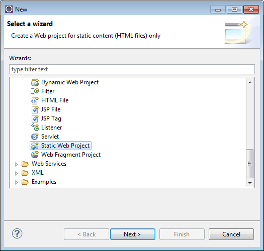
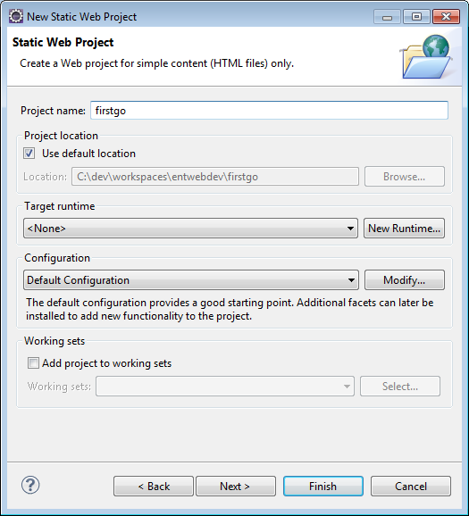
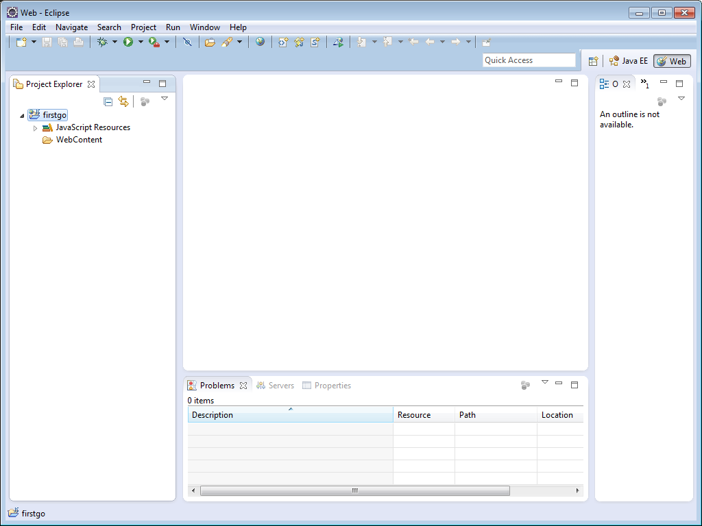
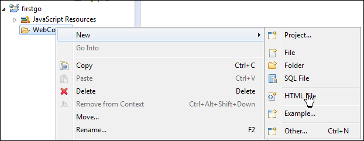
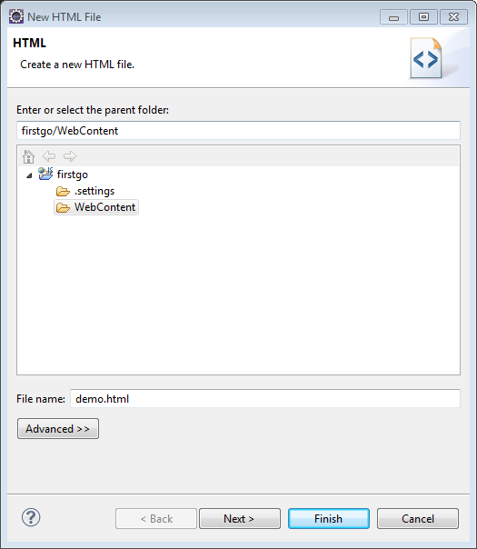
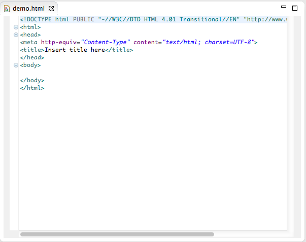
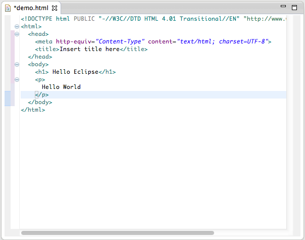
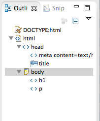
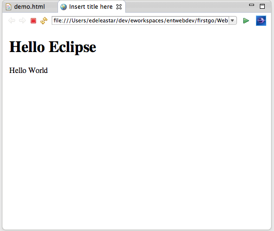

#First Project
ß
In Eclipse, select File->New->Other. Navigate to Web, and select "Static Web Project":

Press "Next" and then give the project a name:

Press "Finish". You will be asked if the project should have a "web perspective":

Select Yes and you should now have an empty project:

We will now create a new HTML file. Select "WebContent" and right click, select "New" and then "Html file" as shown.

Give the file a name and press finish.

 This will create a new html file:

Correct the indentation in the generated code: - by which we mean for every element go in 2 spaces, and as every element concludes, go out 2 spaces.

Also, add some simple markup as a test:

Note the  \* in front of the file name in the tab view. This indicates that the file has not been saved yet. Save the file (File->Save) and observe the \*  disappear.

Also observe the tree view on the right which is providing a structural view of the document tree, as you type it:

We will now attempt to view the file in a browser. We could locate the file on your disk, and open with a browser.However, Eclipse has a built in browser which can be more convenient. To trigger it, select the html file in the "Project Explorer" window ... Right click, select "Open with" and select "Web Browser"

We should now be viewing the same file in a browser, within Eclipse:

